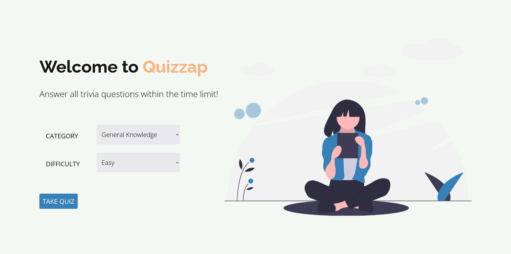
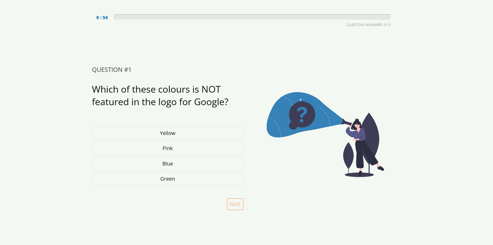
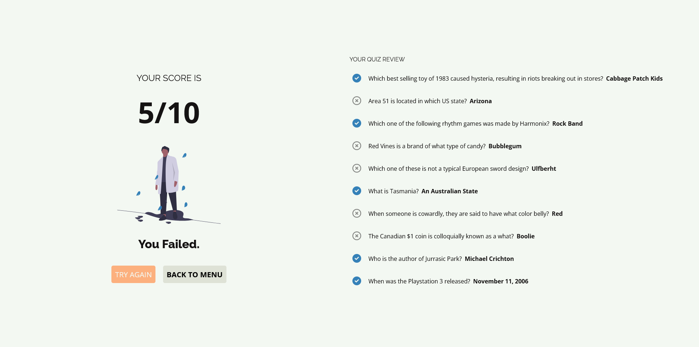

Live Version URL: https://github.com/Aze-Pelayo/quizzap

# About
Quizzap is my first big project using React.js. It is a quiz application with the following features:
- Category and difficulty selection
- Countdown timer
- Allows the user to go back to previous questions to change / review his answers.
- Displays the user's score as well as the questions that he got right/wrong.

# Screenshots

# What I Used
- React.js
- Sass
- Figma
- [Open Trivia DB API](https://opentdb.com/api_config.php)
- [unDraw](https://undraw.co/)
- [Coolors](https://coolors.co/0b0a0a-f3f8f2-3581b8-fcb07e-dee2d6)
- Notion (for project planning)

# Challenges
Here are the files / components that I made:

-   `index.js` 
	- Contains the `reactDOM.render`
-   `App.js`
	- The parent component which sets the states responsible on how the components will appear / hide based on their boolean values.
-   `Intro.js`, `Quiz.js`, `Result.js`
	- Child components. As their names suggest, Intro.js provides the instructions for the quiz, Quiz.js contains the quiz proper, Result.js shows the result.
-  `questions.js`
	- File that contains all quiz questions

Challenge #1 
- I couldn't access the questions from my JSON file. I've searched things on the internet that says you should get a JSON loader and set it up using the `webpack.config` file, some say that the JSON loader is automatically included when you create a React app, while some say that you should just make it a JavaScript file instead of a JSON file. I chose the latter, and everything worked.

Challenge #2 
- I was confused on how to use radio buttons in React. It's true that it was discussed on the React tutorial that I used (Scrimba), and I have my notes for it, but I was confused on how I will set it up such that it will display the questions based on the letter of the choice and that the computer will know which choice the user selected. I solved my problem by using a question state which will hold the choices for each question. The choice state sets which choice the user selected when he clicked a radio button.

Challenge #3 
- The previous button. I was about to give up and change the design of my project similar to a standard multiple choice questionnaire, but I chose not to. I soon found out I can use `localStorage` since I'm only creating a front-end application. `localStorage` didn't cross my mind because I haven't used it in my previous projects. With `localStorage`, I was able to determine that I no longer need an answer state, which is an array that stores the user's answers. At first, since I used the answer state, I tried to learn how to transfer data between components, but deleting and updating the contents of the answer state when the user clicks on the previous button isn't a smart choice, and I'm not fully utilizing the benefits of `localStorage`.

Challenge #4 
- I can't calculate the results of my quiz properly. I realized that localStorage stores everything in string values, even `null` should be stated as `null`. After that, I was able to run my web application successfully.
